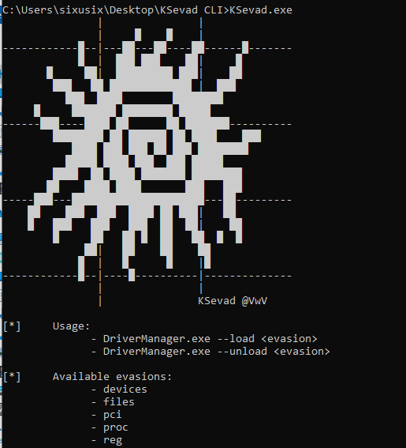
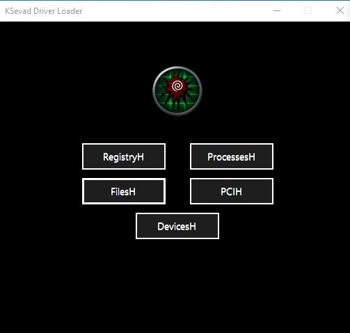

# KSevad

KSevad can load drivers in your system that bypass the following virtualisation detections:
 - Registry.
 - Files.
 - PCI.
 - Devices.
 - Processes.

## Prerequisites
- Test signing enabled: required to load unsigned drivers (https://learn.microsoft.com/en-us/windows-hardware/drivers/install/test-signing).
- PatchGuard Disabled: only mandatory when loading processes for detection bypass (https://github.com/Mattiwatti/EfiGuard?tab=readme-ov-file#usage).

## Installation
1. Compile the project yourself or download the compiled binaries. 
2. Create a folder named 'drivers' and place the compiled drivers (.sys) that will be used in it.

There are two versions available: CLI and GUI.

## Other
Apart from the already compiled "drivers" folder, this repository also has the source code of each driver developed in the DriversSrc folder.

